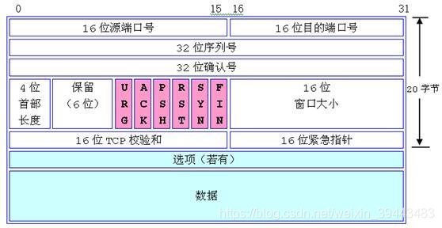
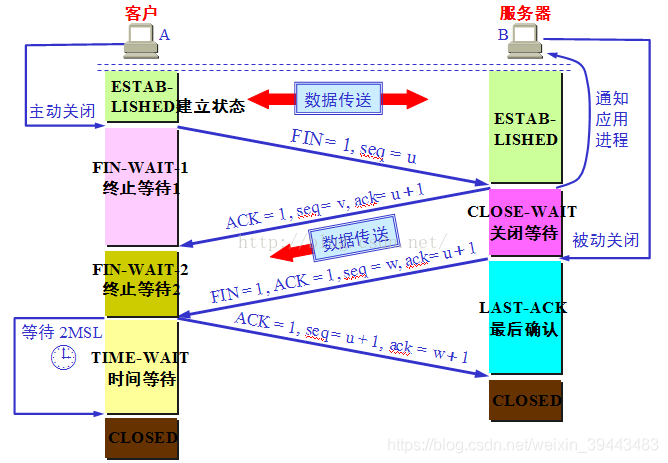
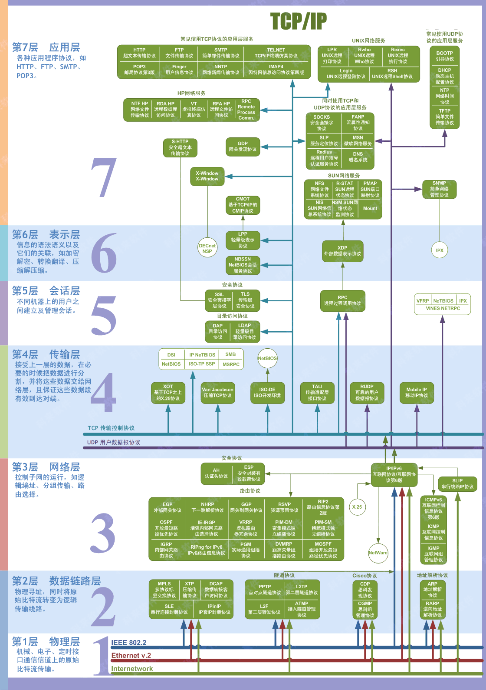

# 字节飞书后端一面

## TCP 三次握手与四次挥手?

\
Seq：用来标识从 TCP 源端向 TCP 目的端发送的数据字节流，它表示在这个报文段中的第一个数据字节的顺序号\
ACK：为 1 表示确认号有效，为 0 表示报文中不包含确认信息，忽略确认号字段\
SYN：同步序号，为 1 表示连接请求，用于建立连接和使序列号同步\
FIN：用于释放连接，为 1 表示发送方没有数据发送了，关闭本方数据流

### 三次握手 类似表白--双工

\
**第一次握手**
客服端给服务器发送一个 SYN 报文\
`客服端发送功能正常`\
client: SYN_SEND server: LISTEN\
**第二次握手**
服务端收到 SYN 报文，回复 SYN + ACK 报文\
`client:发送功能正常, server:接收、发送功能正常`\
client: SYN_SEND server: SYN_RCVD\
**第三次握手**
客户端收到 SYN + ACK 报文之后，回应 ACK 报文\
`客户端的接收、发送能力正常，服务器的发送、接收能力正常`\
client: established server: established

**半连接队列**：

服务器处于 SYN_RCVD 状态，双方还`未完全建立连接`，服务器会把这种状态下的请求`放到半连接队列`。完成`三次握手`的连接所在的队列为`全连接队列`，如果队列满了可能会发生丢包现象。

### 四次挥手 类似挂电话

**客户端-发送一个 FIN** 用来关闭客户端到服务器的数据传送\
客户端：FIN_WAIT1 [等待远程 TCP 中断请求]&nbsp;&nbsp;&nbsp;&nbsp;服务端：ESTABLISHED

**服务器-收到这个 FIN** 它发回一个 ACK，确认序号为收到的序号加 1 。和 SYN 一样，一个 FIN 将占用一个序号\
客户端：FIN_WAIT1 [等待远程 TCP 中断请求]&nbsp;&nbsp;&nbsp;&nbsp;服务端：CLOSE_WAIT

**服务器-关闭与客户端的连接** 发送一个 FIN 给客户端\
客户端：FIN_WAIT2[从远程 TCP 等待连接中断请求]&nbsp;&nbsp;&nbsp;&nbsp;服务端：LAST_ACK[等待中断请求的确认]

**客户端-发回 ACK 报文确认** 并将确认序号设置为收到序号加 1\
客户端：等待 2MSL(TIME_WAIT)-->CLOSED&nbsp;&nbsp;&nbsp;&nbsp;服务端：CLOSED[没有任何连接]

举个例子：A 和 B 打电话，通话即将结束后，A 说“我没啥要说的了”，B 回答“我知道了”，但是 B 可能还会有要说的话，A 不能要求 B 跟着自己的节奏结束通话，于是 B 可能又巴拉巴拉说了一通，最后 B 说“我说完了”，A 回答“知道了”，这样通话才算结束。

## OSI 模型?

## 链路层和物理层的作用?

**物理层(physical layer)的作用** 透明传送比特流表示经实际电路传送后的比特流没有发生变化，对传送的比特流来说，这个电路好像是看不见的。

**数据链路层** 两台主机之间的数据传输,总是在一段一段的链路上传送的, 数据链路层将网络层交下来的 IP 数据报组装成帧.

## 数据库三大范式？

**第一范式** 列[属性]不可再分

**第二范式** 行可以唯一区分，主键约束

**第三范式** 表的非主属性不能依赖与其他表非主属性 外键约束

## 数据库数据较多的时候怎么处理？

创建索引

## 索引越多越好？

1、合理的建立索引能够加速数据读取效率，不合理的建立索引反而会拖慢数据库的响应速度。\
2、`索引越多`，更新数据的速度`越慢`。

## SpringBoot、Spring 和 Spring MVC 区别 ?

**Spring** 最重要的特征是 DI(依赖注入).所有 SpringModules 不是依赖注入就是 IOC 控制反转。当我们恰当使用 DI 或者 IOC 的时候，可以开发低耦合的应用。\
**Spring MVC** 是基于一种设计模式演变而来的 web 应用开发框架，通过 DispatcherServlet, ModelAndView 和 ViewResolver 等概念简化开发流程。
**Spring Boot** 通过提供自动装配和默认启动项，达到更快构建产品的框架。

## Spring AOP？

面向切面编程是对面向对象编程的一种补充，OOP 提供了从上到下的关系，但不适合定义从左到右的关系，例如日志功能、安全、事务等。在 OOP 设计中，它导致了大量代码的重复，而不利于各个模块的重用。通常在 Java 中有 2 种方式实现 AOP：

- 动态代理技术，利用截取消息的方式，对消息装饰，以取代原有对象的行为--JDK Proxy
- 采用静态织入的方式，引入特定的语法创建"切点",从而使得编译器可以在编译器期间织入有关的"切面"--CgLib, aspectj

# 字节飞书后端二面

## 多态的解释？

函数本身具备多态性，某一种事物有不同的具体体现\
`体现`: 父类引用或者接口的引用指向了自己的子类对象\
`好处`: 提高了程序的可扩展性\
`坏处`: 当父类引用指向子类对象时，只能访问父类中具备的方法(前期无法使用后期产生的功能)\
`前提`:

1. 必须要有关系，继承或者实现
2. 通常有覆盖操作

多态在子类中成员上的体现

1. 成员变量：引用那个调用那个
2. 成员函数：编译看引用，运行看父类[覆盖]
3. 静态函数：引用那个调用那个

## 新建 pojo 对象为什么要重写 hashcode()和 equals()?

Java 集合有两类，一类是 List 可重复，一类是 Set 不可重复，通过 hash+值可以快速确定两个对象是否相等，通过 hashCode 可以快速比较两个值是否相等，但不够准确[hash 冲突]，在 hashCode 相等时可以调用 equals()具体确定两个值是否相等，所以任意的对象都可以通过一到两次比较得到是否相等。
